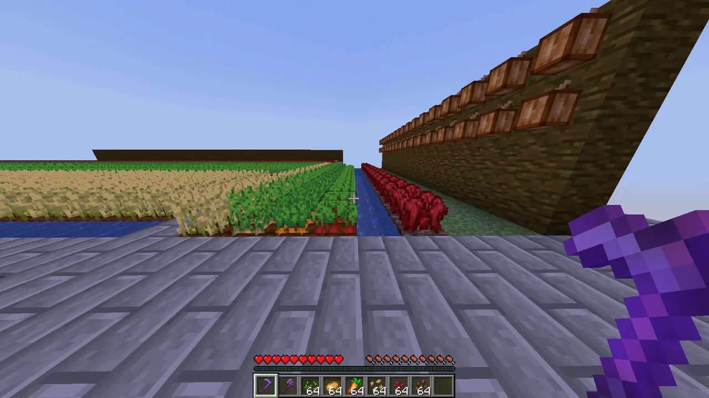

# Replenish++ 🌾

Auto-replant for Paper/Purpur. Break a crop, it goes right back in the ground.

If you ever farmed on Hypixel SkyBlock, you already know the idea, it's Replenish, the enchantment that made farming not completely miserable.



## What it does

- Replants Wheat, Carrots, Potatoes, Nether Wart, Cocoa, and Beetroots automatically
- Immature crops stay at whatever growth stage they were at
- Eats a seed from your inventory on mature harvest (can turn this off)
- Can pipe drops straight into your inventory instead of the ground (also toggleable)
- You actually need the right tool in hand. No hoe, no replant. Cocoa needs an axe.
- Sneaking while you break bypasses auto-replant entirely (toggleable via `sneakToBypass`)
- Cocoa gets replanted facing the right direction, which was annoying to get right
- Fortune works like normal
- Sounds are fully configurable, or you can just mute them all
- Built to not choke on big farms. There's a per-tick replant cap you can tune.

## Install

1. Grab the jar from [Releases](https://github.com/Mitra-88/ReplenishPlusPlus/releases) or the Actions tab if you like living on dev builds
2. Drop it in `plugins/`
3. Start the server
4. (Optional) Customize `plugins/ReplenishPlusPlus/config.yml`, the default settings work fine as-is.

## What happens by default (no config changes)

**Mature crop:**
- Replants as a newly planted crop (age 0 / just planted)
- Takes 1 seed from your inventory/off-hand (if `requirePlayerSeed: true`)
- Drops go to you directly (if `directPickup: true`)

**Immature crop:**
- Replants at the same age it was. No seed needed.
- No drops either, otherwise you could farm infinite seeds by re-breaking young crops.

---

## Commands & permissions

| Command                            | What it does                                 |
|------------------------------------|----------------------------------------------|
| `/replenishplusplus`               | Main menu                                    |
| `/replenishplusplus help`          | Detailed guide                               |
| `/replenishplusplus status`        | Current settings                             |
| `/replenishplusplus version`       | Plugin version & update status               |
| `/replenishplusplus toggle`        | On/off switch for yourself                   |
| `/replenishplusplus toggle global` | On/off switch for everyone                   |
| `/replenishplusplus pad`           | Get a Teleport Pad item                      |
| `/replenishplusplus reload`        | Reload config.yml                            |
| `/replenishplusplus debug queue`   | View replant queue stats                     |

Aliases: `/rpp` and `/replenish` work for everything above.

Permissions:

- `replenishplusplus.use` - everyone
- `replenishplusplus.status` - everyone
- `replenishplusplus.version` - everyone
- `replenishplusplus.toggle` - everyone
- `replenishplusplus.toggle.global` - op
- `replenishplusplus.reload` - op
- `replenishplusplus.debug` - op
- `replenishplusplus.pad` - op (Only meant for devs)
- `replenishplusplus.update` - op
- `replenishplusplus.*` - op (grants all of the above)

## Config

The stuff you'll probably touch:

```yaml
enabled: true
requirePlayerSeed: true
directPickup: true
sneakToBypass: true
messageStyle: CHAT
replantDelayTicks: 3
maxReplantsPerTick: 1024
maxReplantsQueued: 4096
checkUpdates: true
```

> **Note:** `/rpp toggle global` writes the whole `config.yml` back from the last-loaded state. If you edited the file by hand, run `/rpp reload` first, otherwise toggling saves over your manual changes.

Everything players see in chat lives in `plugins/ReplenishPlusPlus/en_us.yml` MiniMessage formatting, same `/rpp reload` applies it.

### Full default config.yml

```yaml
# ==============================================================================
# ReplenishPlusPlus Configuration
# ==============================================================================

# Master switch for the whole plugin. false = nothing replants for anyone.
# Players can still turn it off just for themselves with /rpp toggle.
enabled: true

# true = harvesting a fully grown crop eats 1 seed from your inventory and replants it.
# false = crops replant for free, no seeds involved.
requirePlayerSeed: true

# true = harvest drops go straight into your inventory.
# false = drops fall on the ground like vanilla.
directPickup: true

# true = sneaking while breaking a crop skips auto-replant completely.
# The crop just breaks normally and drops like it would without the plugin.
sneakToBypass: true

# How the plugin talks to players (inventory full, need seed, wrong tool).
# CHAT       = normal chat message.
# ACTION_BAR = above the hotbar, less spammy.
# NONE       = no text at all (sounds still play).
messageStyle: CHAT

# Max delay before a broken crop gets replanted, in ticks. 20 ticks = 1 second.
# Each replant lands on a random tick between 1 and this number, which spreads
# the replant work evenly instead of batching it, so bigger values stay smooth.
# (1 to 10)
replantDelayTicks: 3

# Max crops replanted in a single tick, so nobody can lag the server by
# harvesting a giant farm all at once. (Minimum 256)
maxReplantsPerTick: 1024

# Max replants waiting in the queue at once. If the queue is full, replants get
# dropped instead of piling up and lagging the server. (Minimum 256)
maxReplantsQueued: 4096

# Check GitHub for a new version on startup and tell admins?
# Only read on startup - /rpp reload won't apply changes to this.
checkUpdates: true

# ------------------------------------------------------------------------------
# Crop Settings
# ------------------------------------------------------------------------------
# Set any of these to false to turn auto-replant off for that crop.

crops:
  wheat:       true
  carrots:     true
  potatoes:    true
  nether_wart: true
  cocoa:       true
  beetroots:   true

# ------------------------------------------------------------------------------
# Sound Settings
# ------------------------------------------------------------------------------
# Sound names are forgiving - ENTITY_ITEM_PICKUP, entity.item.pickup and
# minecraft:entity.item.pickup all work. An unknown name logs a warning and
# falls back to the default. Full list: https://jd.papermc.io/paper/org/bukkit/Sound.html
# volume: 0.0 (silent) to 1.0 (loudest)
# pitch:  0.5 (low) to 2.0 (high), 1.0 = normal
# Set enabled: false to kill a sound completely.

sounds:
  # Crops landed in your inventory.
  pickup:
    enabled: true
    sound: ENTITY_ITEM_PICKUP
    volume: 1.0
    pitch: 1.0

  # Your inventory was full and leftovers dropped on the ground.
  inventory-full:
    enabled: true
    sound: BLOCK_NOTE_BLOCK_BASS
    volume: 1.0
    pitch: 0.5

  # You tried harvesting with the wrong tool.
  denied-tool:
    enabled: true
    sound: ENTITY_VILLAGER_NO
    volume: 1.0
    pitch: 0.5

  # You tried harvesting but had no seed to replant with.
  denied-seed:
    enabled: true
    sound: ENTITY_VILLAGER_NO
    volume: 1.0
    pitch: 0.5

  # A replant failed and your seed got dropped back instead of planted.
  replant-failed:
    enabled: true
    sound: ENTITY_ITEM_BREAK
    volume: 0.5
    pitch: 1.0
```

## Contributions

PRs are disabled on this repo, not because I don't want your help but because managing them gets overwhelming for one person, and I'd rather not ghost anyone. Open an issue instead, feature ideas, bugs, optimizations, whatever. We'll talk it out there.

## License

This project is licensed under the [GNU Affero General Public License v3.0](LICENSE).
